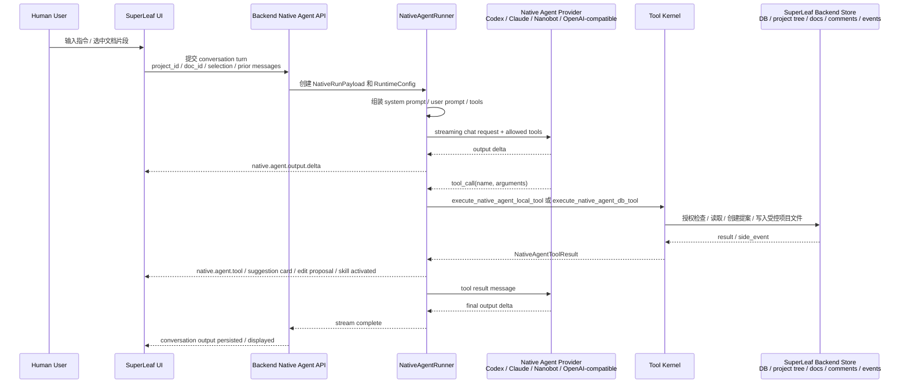
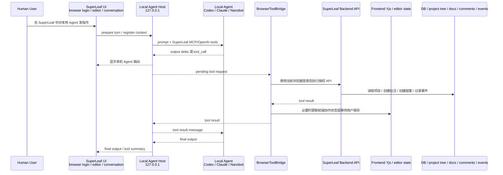

# SuperLeaf MCP 构建方案

这份计划描述如何把 MCP 建成 SuperLeaf 的标准工具协议层，而不是某一个 Agent 的附属功能。目标是让本地 Codex、Claude、Nanobot、后端 Native Agent、未来远程 Agent 都通过同一套 SuperLeaf 工具契约访问项目树、文档、批注、会话、事件和版本。

实际使用步骤见 [Local Agent Host 与 SuperLeaf MCP](./agents/local-agent-mcp.html)。本页只记录架构规划和迭代路线。

## 执行状态

截至 2026-06-06，已经完成计划持久化、Phase 1a、Phase 1b 的 Tool Kernel 初版、Phase 2 的前四段、Phase 3/Phase 4 收尾，以及 Phase 5 的本地安装与常驻运行首段：

- `services/shared/superleaf-tools.json` 已成为第一批 SuperLeaf 工具的共享注册表。
- Local Agent Host 的 MCP `tools/list` 从共享注册表派生，并且下载包会携带冻结的 registry JSON。
- 前端 Codex/Nanobot tool guide 和 marker fallback 从同一份注册表派生，减少“当前 API 通道没有挂载 SuperLeaf 工具”这类错误回答。
- 后端 browser Agent / Nanobot 暴露给浏览器通道的 OpenAI-compatible tool schema 已从共享注册表派生。
- Local Agent Host `/mcp` 已补上 session metadata、session TTL、`DELETE /mcp` close、`GET /mcp` SSE、`Last-Event-ID` replay、内存 event store、`/superleaf/mcp/status` 诊断，以及 context/session 过期时的 pending call cleanup。
- `services/local-agent-host/scripts/smoke-mcp.mjs` 已提供零依赖 MCP Inspector-style 自动烟测，覆盖 initialize、tools/list、GET SSE、Last-Event-ID replay、invalid replay guard、status 和 DELETE close。
- Local Agent Host 已从共享 registry 暴露 `resources/list/read` 和 `prompts/list/get`，当前 resources/prompts 用于描述 Tool Kernel、Browser Bridge 和常见 SuperLeaf 工作流，不直接暴露项目文档内容。
- `services/frontend/src/services/browserToolBridge.ts` 已抽出通用 BrowserToolBridge，Codex MCP bridge 已迁移到共享 context 注册、长轮询、结果回填、heartbeat/context refresh 和 poll 失败恢复逻辑。
- Nanobot 的 browser preflight 与 OpenAI-compatible `tool_calls` 执行路径已复用 BrowserToolBridge 的 request/result 形状；Nanobot 仍是 OpenAI tool adapter，不是 MCP client。
- 讨论区 Agent 气泡已显示 BrowserToolBridge 状态：MCP 已连接、重连中或错误，错误详情可通过状态 chip 查看。
- Local Agent Host 已支持 `GET /codex/sessions` 与 `GET /claude/sessions`，可以按 SuperLeaf conversation/project/workspace 反查本机 Codex/Claude session 映射；讨论区 Agent 气泡也会显示 Local Host session 与 Codex/Claude 外部 session 的短 id。
- 团队管理 Agent 页已加入 Local Host 诊断面板，按 endpoint 汇总 `/health`、`/superleaf/mcp/status`、Codex/Claude health/session list 和 Nanobot Tool Adapter 状态。
- 团队管理 Agent 页已加入 Codex/Claude 本地安装卡片；后端 `/api/native-agent/local-agent-host/package` 会返回安装包版本、文件名、大小、SHA-256 checksum、默认 endpoint/MCP URL、安装 manifest、macOS/Windows 启停命令、start-at-login 安装/卸载命令和 Codex/Claude 环境开关；后端 fallback ZIP 与真实 package 都携带 Windows launcher、常驻运行脚本、`superleaf-tools.json`、安装 manifest、SDK 迁移 gate 和 smoke/matrix 诊断脚本，并会忽略缺少 Phase 5 必需资产的旧 `dist` 包；安装卡片可以在未创建 provider 前直接验证默认 Local Host 的 `/health`、`/superleaf/mcp/status` 和 `/superleaf/install/status`，并显示后台常驻状态、package version、data dir、pid 与 manifest 状态。
- 后端已提供 `/api/native-agent/local-agent-host/update` 只读 update metadata，用于后续自动升级前先统一 latest version、checksum、manifest 和下载路径；当前策略仍是 `manual-download`，不会自动替换用户本机文件。
- Local Host 已新增 `npm run gate:mcp-sdk`，参考官方 MCP TypeScript SDK 的 stateful Streamable HTTP transport 与 MCP Inspector 的 Streamable HTTP client/server 测试形状，固定迁移前必须保持的 session header、missing/unknown session、SSE、Last-Event-ID replay 和 DELETE close 语义。当前只判定“可作为 SDK 迁移候选”，没有替换零依赖兼容层。
- Local Host 已新增 `npm run inspector:config|ui|cli`，生成官方 MCP Inspector `streamable-http` 配置，并可按需通过 `npx @modelcontextprotocol/inspector` 打开 Inspector UI 或 CLI；Inspector 不作为下载包 runtime dependency。
- 后端 Native Agent 的 workspace/project/skill/browser 工具 schema 与 allowlist 已拆到 `services/backend/app/services/native_agent_tool_kernel.py`；项目文档读写、搜索、outline、edit proposal、suggestion、`.agents` 工作区文件读取和 Skill 激活等执行 handler 已迁入 Tool Kernel 执行层。`NativeAgentRunner` 现在保留模型 streaming、session/messages、tool-call loop、前端事件发射和外部 MCP 调度。
- 后端原生 MCP 已拆成可选 profile：`services/backend/app/mcp/` 只处理 MCP JSON-RPC/session/router，`services/backend/app/agent_commands/` 承载 Agent 可执行命令并复用后端 Project/FS/Member/Annotation 服务。普通 `./start.sh backend` 默认不挂载 `/mcp`，`./start.sh mcp` 或 `YLW_MCP_SERVER_ENABLED=1` 才启用后端原生 MCP；Local Agent Host 的浏览器 Bridge MCP 仍独立运行在 `services/local-agent-host/`。
- 后端原生 MCP 已补齐 JSON-RPC batch、`GET /mcp` SSE、动态 `superleaf://context/current` resource、`GET /mcp/status`、工具异常包装、session TTL/数量上限，并让旧 `/api/mcp` 数据路由复用 Agent Command 执行器，避免 grep/read/outline 逻辑分叉。Local Agent Host 的显式 backend proxy 也改为转发后端 `/mcp`，不再调用旧 REST 数据路由。
- 共享工具注册表已为每个 MCP tool 补充 MCP `annotations` 和 `_meta.superleaf`，标明只读性、写入面、ground truth、scope、正文 mutation 路径和 anchor 策略；后端原生 MCP 与 Local Agent Host 都会透传这些标注。
- `propose_doc_edit` 与 `create_suggestion` 已复用批注重定位策略：MCP 写入 proposal/annotation DB 前，会用 `original_text` 修正过期 range，并返回 `anchor_status`、`anchor_reason`、`anchor_confidence` 与修正后的范围。

## 目标

SuperLeaf 的 MCP 体系要同时满足两类需求：

- 本地强 Agent 可以在 SuperLeaf UI 中被调用，并稳定访问当前项目、当前文档、选区和批注能力。
- SuperLeaf 仍然保持多人实时协作和权限边界，Agent 不直接拿用户 cookie，也不绕过前端和后端的授权模型。

最终形态：

```text
Human / Local Agent / External Agent
        |
        v
SuperLeaf API / CLI / MCP
        |
        v
SuperLeaf Tool Kernel
        |
        +--> Browser Bridge -> current browser auth -> backend-authorized tools
        +--> Yjs/collab layer -> realtime UI state
        +--> backend persistence -> project tree, docs, comments, sessions, events, versions
```

## 参考项目结论

本计划参考了 `/Volumes/DevLayer/Reference` 下的 MCP 项目：

- `mcp-typescript-sdk`：提供标准 Streamable HTTP transport、session、capability、tools/list、tools/call、resources/prompts 支持。当前已借鉴它的 `POST /mcp`、`GET /mcp`、`DELETE /mcp`、`Mcp-Session-Id`、`Last-Event-ID`、SSE `event: message` 和 `EventStore` 语义；后续再从手写兼容层迁移到 SDK 实现。
- `supergateway`：提供 stdio 到 Streamable HTTP/SSE/WS 的桥接实现。它的 stateful session map、access counter、timeout cleanup 很适合 Local Agent Host。
- `mcp-proxy`：展示了如何做协议代理、认证、event store 和 request timeout。当前已借鉴它的 `InMemoryEventStore` 思路，给 Local Host 增加按 stream 的事件存储、TTL、容量上限和 replay-after。
- `mcp-inspector`：展示了面向开发者的 session 初始化、工具枚举、Streamable HTTP 连接和诊断检查流。当前 `npm run smoke:mcp` 借鉴它的 inspector-style session 验证顺序，但保持零依赖。
- `openai-agents-js`：把 MCP server 抽象成 `connect / listTools / callTool / close / cache / filter / invalidate`，适合借鉴为 SuperLeaf Agent Tool Runtime。
- `fastmcp`：强调 request-scoped context、dependency injection、session visibility，适合 SuperLeaf 表达当前用户、项目、文档和选区。
- `cloudflare-mcp-server` 与 `cloudflare-agents`：适合后续远程 MCP、OAuth、scope、观测和多租户授权设计。

## 总体架构

```text
SuperLeaf Tool Kernel
  - 唯一工具注册表
  - 工具 schema
  - 参数校验
  - 权限策略
  - 审计事件
  - 执行后端接口或 Yjs/collab 操作

SuperLeaf MCP Gateway
  - Streamable HTTP /mcp
  - tools/list
  - tools/call
  - resources/list/read
  - prompts/list/get
  - session and event replay

Local Agent Host
  - runs on 127.0.0.1
  - exposes SuperLeaf /mcp to local agents
  - bridges local agent tool calls to the active SuperLeaf browser
  - does not receive SuperLeaf cookies

Browser Bridge
  - registers current project/document/selection context
  - long-polls pending tool requests
  - executes backend-authorized tool APIs using current browser auth
  - sends result back to Local Agent Host

Agent Adapters
  - Codex: native MCP config injection
  - Claude: MCP config generation or local adapter
  - Nanobot: OpenAI-compatible tool/marker adapter backed by the same Tool Kernel
  - Backend Native Agent: existing MCP client, upgraded to shared registry and policy
```

## 核心设计原则

1. SuperLeaf Tool Kernel 是唯一真相。

   工具 schema 不应散落在 Codex prompt、Nanobot prompt、Local Host MCP server、后端 Native Agent 里。所有 consumer 都从同一份注册表生成各自格式。

2. Agent 不直接继承浏览器权限。

   Local Agent 通过 MCP 调工具时，Local Agent Host 只负责排队和协议转换。真正执行 SuperLeaf 后端工具的是 Browser Bridge，它拥有当前用户登录态。

3. 写操作必须按写入面分类。

   `propose_doc_edit` 创建 pending proposal/annotation DB 记录；`create_suggestion` 创建批注 DB 记录；`project_write_text_file` 创建新的 Project FS / DB 文档并拒绝覆盖；已有文档正文修改仍必须走 proposal -> 用户接受 -> editor/Yjs 写入路径。不能把这些都称为“直接写正文”或“只读”。

   当前后端原生 MCP 只允许两类写入：创建 suggestion/annotation，以及创建新文本文件且拒绝覆盖。它还没有提供“直接改已有正文”的工具；这个能力需要先定义 Yjs-first 写入路径，避免后端 DB 与协作文档状态分叉。

4. Agent session 只保存 input/output/tool summary。

   SuperLeaf 不保存本地 Codex/Claude/Nanobot 的内部思考、隐藏上下文或本地私有 session 状态。SuperLeaf 只保存可见输入、可见输出、工具调用摘要和审计字段。

5. 本机入口默认 loopback。

   Local Agent Host 默认绑定 `127.0.0.1`，远程访问必须走 OAuth 或短期 capability token。禁止把本地 Host 暴露为无认证公网服务。

6. 所有工具调用可审计。

   每次工具调用至少记录 `request_id`、`session_id`、`context_id`、`tool_name`、参数 hash、actor、status、duration、失败原因和是否产生写入。

## 第一层：Tool Kernel

Tool Kernel 是 SuperLeaf 工具能力的源头。它负责定义、校验、授权和执行工具。

第一批工具：

- `project_list_docs`：列出当前项目文档。
- `project_read_doc`：读取指定文档或文档片段。
- `project_grep`：在项目文档中搜索。
- `project_outline`：返回文档结构。
- `propose_doc_edit`：创建文档修改提案。
- `create_suggestion`：创建批注或 suggestion 卡片。

后续工具：

- `project_create_doc`
- `project_rename_doc`
- `project_move_doc`
- `project_delete_doc`
- `comment_reply`
- `annotation_resolve`
- `version_snapshot`
- `yjs_preview_patch`
- `yjs_apply_patch`

注册表输出格式：

- MCP `tools/list` schema。
- OpenAI-compatible `tools` schema。
- Nanobot marker fallback 文档。
- 后端 Native Agent tool definition。
- 文档和测试样例。

建议模块：

```text
services/shared/superleaf-tools.json
services/frontend/src/services/superleafTools.ts
services/backend/app/services/superleaf_tool_registry.py
services/local-agent-host/superleaf-tools.mjs
```

短期可以用并行模块保持运行时兼容，长期用生成脚本从同一份 JSON 产出 TypeScript、Python、MJS。

### Backend Native Agent 执行流

`NativeAgentRunner` 位于 SuperLeaf 后端内部。它不是 Agent 本体，也不是工具执行器；它负责主持一次 Agent turn：组装消息、调用 provider、接收 `tool_calls`、把工具结果回填给 provider，并把流式事件发回前端。



这个执行流里有三个关键边界：

- Agent provider 只看见 Runner 允许暴露的工具 schema 和上下文，不直接拿数据库连接、项目文件系统或全部 Skill。
- Tool Kernel 才执行工具。它统一处理 SuperLeaf project/document tools、`.agents` 工作区文件读取和 Skill 激活。
- Runner 仍保留会话编排。它决定当前 turn 的 messages、session、tool loop、前端事件和外部 MCP 调度。

### Local / External Agent 执行流

本地 Codex、Claude、Nanobot 或其他外部 Agent 不应该直接访问服务器上的 `.agents` Skill，也不应该直接写 SuperLeaf 数据库。它们把 SuperLeaf 当成一个工具端口，通过 Local Agent Host、Browser Bridge、MCP/API/CLI 进入当前用户授权的 SuperLeaf context。



这个路径和 Backend Native Agent 不同：本地 Agent 的授权来自浏览器当前用户，而不是服务器主动访问用户本机。Local Agent Host 默认只绑定 loopback，Browser Bridge 持有当前 SuperLeaf 页面 context，并负责把工具请求转成后端授权 API 调用。

### 模块化边界

当前模块职责如下：

- `NativeAgentRunner`：模型回合编排器。负责 streaming、session/messages、tool-call loop、provider 参数、前端事件发射和外部 MCP 调度。
- `Tool Kernel`：工具定义与执行层。负责工具 schema/grouping、DB-backed SuperLeaf tools、`.agents` 工作区文件工具、Skill 激活、返回格式和 side event。
- `SuperLeaf Backend API / Store`：项目、文档、批注、会话、事件、版本和权限的事实来源。
- `BrowserToolBridge`：浏览器授权执行边界。负责把本地 Agent 的 pending tool request 转成当前用户可执行的 SuperLeaf API 调用。
- `Local Agent Host`：本机协议代理。负责把本机 Codex/Claude/Nanobot 接到 SuperLeaf tools，但不持有服务器数据库权限。

这样拆分后，新增 provider 不需要重写 SuperLeaf 工具；新增工具也不需要改每个 provider 的执行逻辑。Runner 可以继续专注“怎么跑这一轮 Agent”，Tool Kernel 专注“这个工具能不能执行、怎么执行、返回什么”。

### 安全性边界

这个设计刻意避免让 Agent provider 成为数据库超级用户。

- 工具 allowlist 按 surface 区分。Backend Native Agent、browser Nanobot、本地 Codex/Claude MCP、未来 Remote MCP 可以看到不同工具集合。
- 项目工具必须带 `project_id`、`user_id`、active document/selection 等上下文，Tool Kernel 执行时再次校验项目归属和写权限。
- `propose_doc_edit` 和 `create_suggestion` 默认创建提案或批注卡，不直接改正文；真正落盘由用户批准或显式 trusted 写入模式决定。
- `.agents` 文件读取仍走 `agent_workspace_service` 的安全路径解析，只允许 `.agents` 范围内的安全文本文件，防止路径逃逸。
- Skill 激活只读取当前 Agent 配置允许的 Skill，不把服务器 Skill 默认公开给本地或外部 Agent。
- Local Agent Host 默认 loopback；远程 Agent 后续必须走 Remote MCP + OAuth 或 capability token。
- SuperLeaf session 只保存 input/output/tool summary，不保存本地 Codex/Claude/Nanobot 的私有内部 session 或隐藏上下文。
- 工具调用可以审计：tool name、actor、context、参数摘要、结果状态、side event 和失败原因都可以被记录。

## 第二层：MCP Gateway

MCP Gateway 负责把 Tool Kernel 暴露为 MCP server。

当前 Local Agent Host 已有实现：

```text
POST /mcp
GET  /mcp
DELETE /mcp
GET  /superleaf/mcp/status
POST /superleaf/mcp/context
GET  /superleaf/mcp/tool-requests
POST /superleaf/mcp/tool-results
```

升级目标：

- 在保持下载包零安装依赖的前提下，先实现 `@modelcontextprotocol/sdk` 的 Streamable HTTP 关键语义。
- 已完成 SDK 风格 stateful session 行为，区分缺失 session、未知 session、过期 session。
- 已添加 event store，支持 reconnect 后 replay 未完成事件。
- 后续在打包器能可靠携带 npm 依赖后，再把协议层替换为官方 `@modelcontextprotocol/sdk` transport。
- 已暴露 registry-backed `resources/list` 和 `resources/read`。
- 已暴露 registry-backed `prompts/list` 和 `prompts/get`。
- 已增加 MCP Inspector-style smoke test：`cd services/local-agent-host && npm run smoke:mcp`。

Local Host 的 MCP Gateway 只服务本机 Agent。未来远程 Agent 要使用独立 Remote MCP Gateway，不复用无认证 loopback 入口。

## 第三层：Browser Bridge

Browser Bridge 是授权执行边界。

职责：

- 注册当前 SuperLeaf context：project、conversation、document、selection、inputs。
- 保持 heartbeat，避免 Host 使用过期 context。
- 长轮询或 SSE 接收 pending tool request。
- 调用现有后端授权 API 执行工具。
- 将工具结果提交给 Local Agent Host。
- 在 UI 中显示工具运行状态、失败原因和写入提案。

建议抽象：

```text
BrowserToolBridge
  registerContext()
  refreshContext()
  pollRequests()
  executeTool()
  submitResult()
  heartbeat()
  recoverPendingRequests()
  stop()
```

Codex、Nanobot、Claude local adapter 都应复用这个 bridge，而不是分别实现轮询和工具执行。

## 第四层：Agent Adapter

不同 Agent 的工具能力不同，因此 SuperLeaf 需要 adapter 层。

### Codex

Codex 已经适合直接使用 MCP。

策略：

- Local Agent Host 启动 Codex app-server 时自动注入：

  ```toml
  [mcp_servers.superleaf]
  url = "http://127.0.0.1:8787/mcp"
  ```

- SuperLeaf 仍然保留 marker fallback，用于旧 Host 或 MCP 不可用时。
- 模型、reasoning effort、sandbox、approval policy 在 provider 设置中显式选择。
- 已实现 Local Agent Host `GET /codex/sessions`，支持按 `superleaf_conversation_id`、`superleaf_project_id`、`workspace_path` 和 `limit` 过滤，返回 Local Host session id 与 Codex 返回的 `codex_session_id` / `codex_thread_id`。
- 前端 Discussion 气泡显示 `本机会话` / `Codex 会话` 短 id，用于确认 SuperLeaf conversation 是否续到了同一条本地 Codex 会话。

### Claude

Claude 方向分两种：

- Claude Desktop/Claude Code 支持 MCP 时，生成 MCP 配置片段。
- 不支持或不可控时，通过 Local Agent Host 的 generic CLI/app-server adapter 调用。

需要实现：

- Claude provider 的 local endpoint 配置。
- Claude MCP config export。
- Claude session opaque id 映射，不复制本地 session 内容。
- 已实现 Local Agent Host `GET /claude/sessions`，支持按 `superleaf_conversation_id`、`superleaf_project_id`、`workspace_path` 和 `limit` 过滤，返回 Local Host session id 与 Claude Code 返回的 `claude_session_id`。
- 前端 Discussion 气泡显示 `本机会话` / `Claude 会话` 短 id，用于确认 SuperLeaf conversation 是否续到了同一条本地 Agent 会话。

### Nanobot

Nanobot 当前是 OpenAI-compatible chat，不应强迫它实现 MCP client。

推荐路径：

```text
Nanobot chat
  -> SuperLeaf AgentToolAdapter
  -> OpenAI-compatible tools or marker fallback
  -> SuperLeaf Tool Kernel
  -> Browser Bridge
  -> tool result back to Nanobot
```

阶段目标：

- 先让 Nanobot 使用共享 Tool Kernel schema。
- 优先解析 OpenAI `tool_calls`。
- 保留 `<superleaf_tool_call>` marker fallback。
- 长期在 Local Agent Host 内置 Nanobot MCP adapter，使 Nanobot 不必知道 MCP，但仍复用 MCP tool execution。

### Backend Native Agent

后端已有 MCP client，可以继续作为 SuperLeaf as MCP Client 的路径。

改进方向：

- 从共享 registry 读取工具 schema。
- 为 remote MCP 增加 cache、filter、health、timeout 和 error function。
- 对 stdio MCP 继续保持部署策略保护。
- 不把后端 Native Agent 的 MCP client 和 Local Agent Host 的 Browser Bridge 强行合并。

## 权限与安全

Local Agent Host：

- 默认 `127.0.0.1`。
- 必须校验 Origin/Host。
- 不接受公网无认证访问。
- 可以用 pairing code 或一次性 token 绑定 browser context。
- browser context 过期后工具调用失败。

Remote MCP：

- 必须使用 OAuth 或短期 capability token。
- scope 至少包括：
  - `project:read`
  - `document:read`
  - `annotation:write`
  - `proposal:write`
  - `document:write`
  - `version:write`
- 默认禁止 document direct write。

工具权限分级：

- Read：只读项目/文档。
- Suggest：创建批注、提案。
- Mutate：直接写 Yjs 或数据库。
- Admin：版本、成员、配置。

## 会话与持久化

SuperLeaf 云端保存：

- user input
- assistant visible output
- tool call summary
- tool result summary
- created proposal/comment ids
- local session opaque ids

SuperLeaf 云端不保存：

- Codex/Claude/Nanobot 内部 session 内容
- 隐藏思考
- 本地 workspace 私有文件，除非用户明确通过工具提交

Local Agent Host 保存：

- SuperLeaf conversation id 到 local Agent session id 的映射。
- Host 自己的 pending request metadata。
- 不保存 SuperLeaf cookie。

## 实施阶段

### Phase 1：统一工具注册表

目标：

- 抽出 SuperLeaf tool schema。
- Local Host `/mcp tools/list` 使用 registry。
- Nanobot/Codex prompt fallback 使用 registry。
- 保持现有行为不变。

验收：

- MCP `tools/list` 仍返回 6 个工具。
- Nanobot marker prompt 仍显示同样工具。
- Codex fallback prompt 仍显示同样工具。
- 前端 build、Local Host syntax check 通过。

### Phase 2：Local Host SDK 语义兼容

目标：

- 先实现 MCP TypeScript SDK 的 Streamable HTTP 关键语义，保持下载包无需 `npm install`。
- 已增加 stateful session、session timeout、DELETE close。
- 已增加 `GET /mcp` SSE、event store 与 reconnect replay。
- 后续再用 MCP TypeScript SDK 替换手写 JSON-RPC。
- 已增加 MCP Inspector-style 测试脚本。

验收：

- `npm run smoke:mcp` 能自动完成 initialize/list/SSE/replay/status/delete。
- `npm run smoke:mcp` 覆盖 `resources/list/read` 和 `prompts/list/get`。
- 后续再接入真正的 MCP Inspector UI 或 CLI 做人工协议排查。
- `GET /mcp` 能返回 SSE event id，`Last-Event-ID` 能回放断线期间的 SuperLeaf lifecycle event。
- 模拟浏览器 bridge 能完成 tool call。
- session 过期和缺失错误码符合 MCP 预期。

### Phase 3：通用 BrowserToolBridge

目标：

- 已从 Codex 专用实现抽出通用 BrowserToolBridge。
- 已让 Codex 复用 register/poll/execute/submit。
- 已添加 heartbeat、context refresh 和 poll 失败后的 context recovery。
- 已让 Nanobot 的 OpenAI-compatible `tool_calls` 与 preflight 工具执行复用同一套 bridge request/result 形状。
- 已在讨论区 Agent 运行状态中显示 MCP 已连接、重连中和错误。
- 已新增 `claude-local` 第一版：Local Host 提供 `/claude/health`、`/claude/sessions`、`/claude/sessions/:id/turns`；后端提供 `browser-claude/prepare|tool|finish`；前端 Provider 表单、健康检查、会话分发和 MCP bridge 复用同一条 BrowserToolBridge。
- 已补 Claude/Codex session 映射策略、CLI 兼容矩阵、Tool Mode 判定和只读 readiness 脚本 `npm run matrix:local-agents`。

验收：

- Codex MCP 工具调用正常。
- Nanobot fallback / OpenAI-compatible tool call 工具调用正常。
- Claude Local 在 `MCP first` 下能通过本机 Claude Code 调用 `project_*`、`propose_doc_edit`、`create_suggestion`。
- Host 重启或浏览器短断线时在讨论区给出明确失败或恢复状态。

### Phase 4：Nanobot Tool Adapter

目标：

- 已让 Nanobot 使用共享 Tool Kernel schema。
- 已优先使用 OpenAI-compatible `tool_calls`。
- marker 作为 fallback。
- 已增加 Local Host `/nanobot/health` 和 `/nanobot/tools`，用于暴露 Nanobot adapter 的 OpenAI-compatible tool schema、MCP URL、marker 示例和 browser bridge 状态。
- 已让前端 browser Nanobot discovery 同步 adapter 元数据，并在团队管理中显示 SuperLeaf Tool Adapter 状态；旧 provider 若指向 Nanobot 本体，会自动 fallback 检测默认 Local Host，并可通过 UI 同步 `local_agent_host_endpoint`。
- 已新增 `npm run matrix:nanobot-tools`：默认只读检查 adapter；显式 `SL_NANOBOT_TOOL_CALL_LIVE=1` 时通过 Local Host 调用 Nanobot 并分类 `native_tool_calls`、`marker_fallback`、`plain_text` 或 `error`，但不会执行返回的工具。

验收：

- Nanobot 不再回答“当前 API 通道没有 SuperLeaf 工具”。
- 读文档、搜索、创建 suggestion 都能稳定执行。
- `GET /nanobot/tools` 返回 6 个 registry-derived OpenAI function tools。
- Provider 同步后显示 `SuperLeaf Tool Adapter` 状态；缺少元数据时显示 `needs Local Host` 和同步按钮，而不是误报工具不存在。
- 原生 `tool_calls` 稳定性不靠猜测判断；用 live probe 输出 verdict。当前策略是支持原生 `tool_calls`，同时保留 marker fallback。

### Phase 5：Claude/Codex 本地安装体验

目标：

- Team 管理提供 Local Host 下载、安装包信息、健康检查、MCP 注册指引。
- Codex 显示自动注入状态，默认使用 `MCP first`。
- Claude 通过 Local Host 临时 MCP config 使用 SuperLeaf tools。
- Local Host 下载包同时支持 macOS 和 Windows，并携带本地诊断脚本、安装 manifest 和 checksum。
- Local Host 下载包提供 macOS LaunchAgent 与 Windows Scheduled Task 的 start-at-login 安装/卸载脚本，并通过状态接口报告是否常驻。
- 后端提供只读 update metadata，为后续自动升级 UI/installer 做版本、checksum、manifest 和下载路径的统一入口。
- 原生 installer、自动替换、签名/公证、系统托盘等桌面体验暂缓，保留为桌面分发阶段任务。

验收：

- 新机器下载 Local Host 后可连通。
- Codex/Claude provider 能检测 MCP tools。
- 用户知道当前 Agent 是否能看到 SuperLeaf tools。
- 用户能在尚未添加 provider 前验证 Local Host 是否已启动、MCP tools 是否可见。
- 下载包 metadata 可以在 SuperLeaf UI 中显示，且后端 fallback ZIP 不会缺少 Windows 或 MCP 诊断资产。
- 下载包 checksum、manifest 和必需文件列表可以由 SuperLeaf 后端统一校验，为后续自动升级做准备。
- 用户能在安装卡或诊断面板看到 Local Host 是否已配置登录启动、当前 package version、data dir、pid 和 manifest 状态。
- 后端 update metadata 可以在不执行安装动作的前提下告诉前端当前包是否有新版本。
- SDK 迁移 gate 可以稳定通过，且任何未来 SDK transport 替换都必须继续通过 smoke、gate、Inspector CLI、matrix 四类检查。

### Phase 6：Remote MCP 与团队 Agent

目标：

- 建立 SuperLeaf Remote MCP Endpoint。
- 使用 OAuth 或 capability token。
- 支持多人团队 Agent。
- 工具写入仍默认 proposal。

验收：

- Remote Agent 可以读项目、创建提案。
- 权限 scope 可配置。
- 审计日志完整。

## 测试策略

单元测试：

- registry 输出 MCP schema。
- registry 输出 OpenAI tool schema。
- tool argument validation。
- marker fallback parser。

集成测试：

- `/mcp initialize`
- `/mcp tools/list`
- `/mcp tools/call`
- browser bridge poll/submit。
- timeout/error。

端到端测试：

- Codex 在 SuperLeaf 中读取当前文档。
- Codex 创建 edit proposal。
- Nanobot 搜索项目文档。
- Nanobot 创建 suggestion。
- 浏览器断线、Host 重启、context 过期。

## 风险与取舍

- Local Host 当前在 `.gitignore` 中。短期可继续作为 bundle 产物，正式进入大版本时应纳入版本控制。
- SDK 迁移可能改变 MCP session 行为，需要保留一轮兼容测试。
- Nanobot 是否稳定输出 OpenAI `tool_calls` 取决于 Nanobot 自身实现，因此 marker fallback 不能立即删除。
- Browser Bridge 依赖用户打开 SuperLeaf 页面。无人值守远程 Agent 需要 Remote MCP + OAuth，而不是 Local Host。
- 直接写 Yjs 的 Agent 权限风险高，应晚于 proposal/suggestion 模式。

## 当前下一步

继续推进 Phase 5 和后续工具内核整理：

1. 根据 `matrix:nanobot-tools` 的 live probe 结果，长期观察是否可以弱化 marker 提示。
2. Phase 6：建设 Remote SuperLeaf MCP Endpoint，使用 OAuth 或 capability token 支持团队/远程 Agent。
3. 后续如果要替换官方 MCP TypeScript SDK transport，必须先保持 `smoke:mcp`、`gate:mcp-sdk`、Inspector CLI 和 matrix 都通过。
4. 暂缓：Local Host 纳入版本控制、原生 installer、自动替换升级、签名/公证、系统托盘和首次启动向导。
